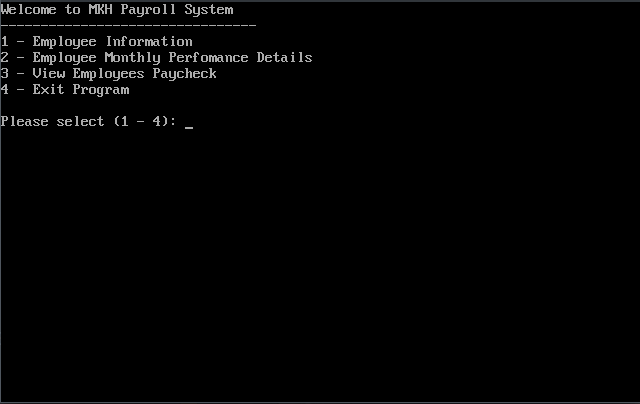

Payroll System
==============

A payroll system written in 8086 assembly suited for a Malaysian environment.

Created for a college assignment.



Features
--------

- Accepting and using floating point values using FPU
- Support for overtime rate, public holiday rate, EPF, SOCSO, and EIS calculations.
- Looking up EPF, SOCSO, and EIS rates for accurate calculation

Compiling
---------

The program runs in a DOS environment. A DOS emulator is used for compiling and running the program.
The program is only tested on [DOSBox](https://www.dosbox.com/), but should work on other DOS emulators.

Note: The following instructions assume DOSBox is installed on the user's system. 

### Linux

cd into the program directory and run 

```shell
dosbox
```

The `dosbox.conf` should automatically mount and compile the script `main.exe` into the `OUT/` directory

### Windows

Mount the directory of the project. The project contains the required compiler and linker.

```cmd
set PATH=C:\bin;

masm main.asm;
link main.obj;
```

The executable `main.exe` would be compiled into the project directory.

LICENSE
-------

Licensed in the [MIT](https://choosealicense.com/licenses/mit/) license.
